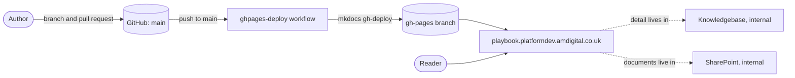

# AM Technology Playbook

The public statement of how AM's Technology department works, published at <https://playbook.platformdev.amdigital.co.uk/>.

## What it is

The Playbook describes how the department turns ideas into released software, the quality standards it holds itself to, the culture it expects, and what it is like to work here. It is written for anyone in the department, colleagues elsewhere in AM, candidates, and anyone curious. It is public on purpose: publishing it lets us be held to it.

It includes: How we work, Quality, Culture, People and a Glossary. Anything that names a tool, a repository, a specific procedure, or a person belongs somewhere else.

### Where things belong

| Home | Holds | Test |
|---|---|---|
| **Playbook** (this repository, public) | Principle and shape: how we work, what we value, the standards we hold | Would an outsider or a new joiner need it to understand us? Does it survive a tool change? |
| **Knowledgebase** ([docs-knowledgebase](https://github.com/amdigital-co-uk/docs-knowledgebase), internal) | Procedure, standards detail, runbooks, templates, team agreements, platform and tooling documentation, decision records | Does it name a repository, a tool, a person, a path, a step? |
| **SharePoint** (internal) | Live documents and lists worked in day to day: proposals, canonical objective documents, outcome specifications, the roadmap and dashboards, the deployment log, release plans, service desk runbooks | Is it a record that changes as work progresses, owned outside engineering, or needed by the wider business? |

If a change to the Playbook would fail the first test, it goes to one of the other two homes. The Playbook may say that the Knowledgebase holds something; it never deep-links into it.

## Status and owners

| | |
|---|---|
| Status | Active. Rewritten October 2026; see [plans/](plans/) for the design, decisions and page inventory. |
| Owners | Technology leadership (`@amdigital-co-uk/tech-leadership`, per [CODEOWNERS](.github/CODEOWNERS)) |
| Help | The Technology channel in Microsoft Teams. Open an issue or pull request here for corrections. |

## Built with

- [MkDocs](https://www.mkdocs.org/) with the [Material for MkDocs](https://squidfunk.github.io/mkdocs-material/) theme, on Python 3. Versions are not pinned; the scripts and the workflow install the latest.
- Plugins: `awesome-pages` (navigation from `.pages` files), `search`, `glightbox`, `git-revision-date-localized`, `git-committers`
- Markdown extensions from [PyMdown](https://facelessuser.github.io/pymdown-extensions/): admonitions, tabs, superfences with Mermaid, snippets (used to inline the SVG diagrams)
- Hosted on GitHub Pages behind the custom domain in [docs/CNAME](docs/CNAME)

## How it is published



Every push to `main` runs [ghpages-deploy.yml](.github/workflows/ghpages-deploy.yml), which installs the plugins, re-enables the Insiders-only configuration lines in `mkdocs.yml` and runs `mkdocs gh-deploy --force`. There is no staging site; the pull request is the review gate, and a local build is the preview.

## Getting started

Prerequisites: [Python 3](https://www.python.org/downloads/) with `pip` (the scripts use the Windows `py` launcher; substitute `python` elsewhere), and Git.

```bash
git clone https://github.com/amdigital-co-uk/docs-playbook.git
cd docs-playbook
install-and-run.bat
```

The first command installs the plugins and starts a local server at <http://localhost:8000/> that reloads on save. After the first time, `run.bat` is enough. To build without serving, and to see the warnings a pull request must not add:

```bash
py -m mkdocs build
```

Visual Studio Code users can press F5, which runs `run.bat` through [.vscode/launch.json](.vscode/launch.json). Nothing needs credentials to build locally: the `git-committers` plugin is switched off outside CI and the Insiders features are skipped.

## Environments and deployment

| Environment | Address | Deployed by | Who |
|---|---|---|---|
| Local | <http://localhost:8000/> | `run.bat` or `py -m mkdocs serve` | Anyone with the repository |
| Production | <https://playbook.platformdev.amdigital.co.uk/> | [ghpages-deploy.yml](.github/workflows/ghpages-deploy.yml) on push to `main` | Merging a pull request |

To roll back, revert the commit on `main`; the workflow redeploys. There is no manual step and no approval beyond the pull request review. The workflow does not run on forks.

## Layout

```
docs/                  the site: one folder per section, a .pages file in each for navigation
  index.md             home page: mission, values, how to read the Playbook
  How-we-work/         the operating model, from roadmap to support
  Quality/             testing, standards, security, reliability, decision records
  Culture/             tenets, collaboration, autonomy, improvement, leadership, meetings, hackathons
  People/              onboarding, buddy guide, progression framework (with its spreadsheet), hybrid working, training
  Glossary.md          the vocabulary, defined once
  assets/              fonts, logo, favicon, the two SVG diagrams
  stylesheets/         extra.css: AM colour scheme and the home page grid
  CNAME                the custom domain for GitHub Pages
mkdocs-overrides/      theme overrides: analytics tag and comments partial
plans/                 the 2026 overhaul: design, decisions, page inventory, Knowledgebase handover
.github/               CODEOWNERS; workflows to deploy on push to main and to check links on demand
.vscode/               F5 runs run.bat; see Gotchas for the Install tasks
.claude/               launch config for the Claude Code preview pane
mkdocs.yml             site configuration
install-and-run.bat    first-time setup: install plugins, serve
run.bat                serve
broken-links.json      ignore list for the link check
```

## Writing a page

- Every page carries the same frontmatter: `title`, `authors`, `reviewed`, `next-review`. Set `next-review` to at most eighteen months ahead.
- One idea per page, rarely more than 600 words. Short sentences, active voice, UK English. No em dashes. "AM is", never "AM are".
- Use the words in [docs/Glossary.md](docs/Glossary.md). If you need a new term, define it there in the same change.
- Say that detail lives in the Knowledgebase; do not link to a Knowledgebase or SharePoint page. Internal links are relative paths to other pages in `docs/`.
- Navigation comes from the `.pages` file in each folder. A new page needs a line there.
- Diagrams are SVG files under `docs/assets/images/`, inlined with the snippets syntax (`--8<-- "docs/assets/images/<name>.svg"`) so they inherit the theme's colours. Text and neutral lines in an SVG use `currentColor`.
- `py -m mkdocs build` must finish with no warnings before you open a pull request.

## Gotchas

- Lines in `mkdocs.yml` prefixed `#insiders-only#` are commented out locally and uncommented by the deploy workflow, because Material Insiders cannot be installed without the organisation's licence key. Keep the prefix exactly.
- The deploy workflow uses `mkdocs gh-deploy`, so it pushes to the `gh-pages` branch itself; never commit to that branch.
- Snippet paths are relative to the directory `mkdocs` runs from. Build from the repository root.
- The broken-link check ([check-broken-links.yml](.github/workflows/check-broken-links.yml)) runs only on manual dispatch and ignores external URLs by [broken-links.json](broken-links.json). The MkDocs build is the check that runs on every change.
- Old page URLs from before the 2026 rewrite return 404. There are no redirects.
- The home page embeds a public careers widget whose markup includes a widget key. It is a client-side key, not a secret.
- The `Install` tasks in [.vscode/tasks.json](.vscode/tasks.json) try to install Material Insiders from GitHub using a `GH_KEY` variable. They are a leftover; use `install-and-run.bat`.
- `install-and-run.bat` also installs `mkdocs-blog-plugin`, which the site does not use. Harmless.
- In [ghpages-deploy.yml](.github/workflows/ghpages-deploy.yml) the `env: GH_TOKEN` block sits outside `jobs`, where it has no effect, and `GIT_COMMITTERS_KEY`, which `mkdocs.yml` expects for the `git-committers` plugin, is never set. The deploy works; the committers feature on the published site may not. Fixing this is a change to the workflow, not to this file.

## Further reading

- The internal [Knowledgebase](https://knowledgebase.platformdev.amdigital.co.uk/) and its [repository](https://github.com/amdigital-co-uk/docs-knowledgebase)
- [plans/playbook-overhaul.md](plans/playbook-overhaul.md): why the Playbook looks as it does, and the decisions behind it
- [plans/playbook-overhaul-inventory.md](plans/playbook-overhaul-inventory.md): where every page of the previous Playbook went
- [plans/knowledgebase-handover.md](plans/knowledgebase-handover.md): what the Knowledgebase must hold for the Playbook to stay true
- [Material for MkDocs reference](https://squidfunk.github.io/mkdocs-material/reference/) for the markup the theme supports

## Contributing

Branch from `main` as `<type>/<slug>` (for example `docs/testing-page`), make the change, confirm `py -m mkdocs build` is clean, and open a pull request. Technology leadership reviews every change through [CODEOWNERS](.github/CODEOWNERS). Small corrections can be made with the edit link on any page of the published site, which opens the file on GitHub. Whatever the route, the person making the change is responsible for the page being true, well written and reviewed.
