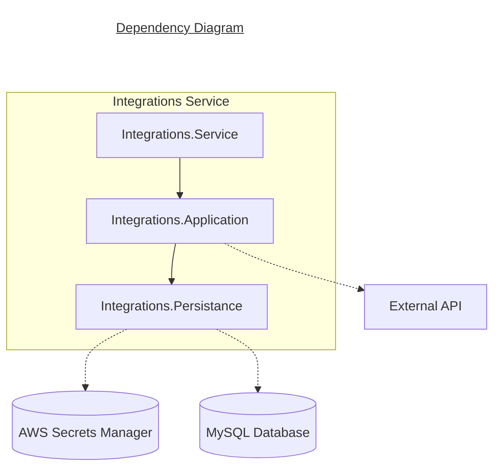
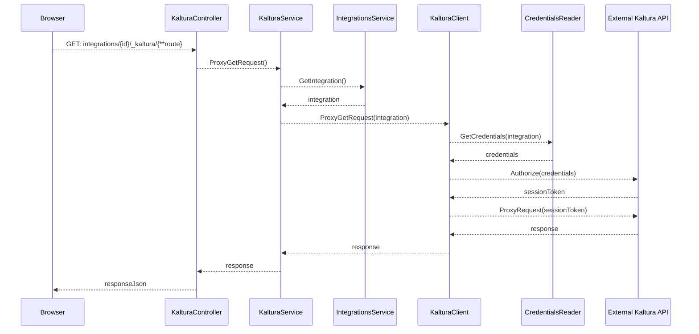

# README files

Every repository must have a file called `README.md` in the root folder. Using [markdown](https://docs.github.com/en/get-started/writing-on-github/getting-started-with-writing-and-formatting-on-github/basic-writing-and-formatting-syntax) files instead of a plain text file allows us to format documentation, add links and images to enrich the documentation. As an added bonus, they get rendered nicely when browsing the repository via the GitHub web UI.

## Why include a README at all?

Every repo must include a README file so that viewers know what the code does and how they can get started using it. Most importantly a README should serve to significantly reduce or remove friction when a new engineer starts working with a repository, so that they can start being productive as quickly as possible.

## Required sections

!!! note

    The layout for our README files is based loosely on the [Best README Template](https://github.com/othneildrew/Best-README-Template) project.

    The Azure DevOps [README guidelines](https://docs.microsoft.com/en-us/azure/devops/repos/git/create-a-readme?view=azure-devops) are also a useful reference.

Every README file must have the following sections:

- Overview
- Built with
- Architecture
- Getting started
- Usage
- Contributing

Whilst these sections are a minimum, and must appear on the README for every repository we manage, they don't need to be lengthy! A brief summary or link out to existing documentation elsewhere is acceptable.

### Overview

Provide a brief overview of the repository, and the problem it aims to solve.

### Built with

List the major technologies and frameworks used within the repository, as a bullet-point list. Ideally link out to some documentation for each item, this is especially important for technologies and frameworks outside our usual tech stack.

Bullet point list of any Quartex Microservices that are used within this repository.

Bullet point list any storage used.

### Architecture

The architecture should highlight the structure of the microservice. A diagram should be supplied, informing readers on how projects relate to each other. [Mermaid-js](https://mermaid-js.github.io/mermaid/#/) diagrams are best used since changes can be tracked easily. An example is shown below:



#### Flows of interest

The Flows of interest section should contain any particularly complex API calls. Basic CRUD operations should **NOT** be described here. Sequence diagrams are a good way to outline this, with participants relating to classes (once inside the API). An example is shown below.



### Getting started

This section must **clearly** describe how someone who has just downloaded the repository can get started running/using it. It must include any pre-requisites or frameworks that must be installed locally, and any additional installation steps where relevant.

This will usually take the form of:

- Linking out to the [Engineer Onboarding steps](https://dev.azure.com/AMDigitalTech/Platform%20Development/_wiki/wikis/AMD-Technology.wiki/385/Engineer-Onboarding)
- A "Running the platform" section

    - A bullet point list with steps and commands required to run the repository

- Ad hoc sections

    - A bullet point list with steps that will only need to be run rarely (updating the database, etc.)

**Note**: Never make any assumptions about the engineer's local environment or tools.

### Usage

Link out a markdown document for each controller. These documents should detail the following for each request in the controller:

- Methods (GET, POST, PUT, DELETE, etc.)
- URL 
- Query Parameters
- Request body
- Response body

### Contributing

How should an engineer who wishes to contribute to the repository do so? In most cases, a link out to the relevant branching strategy and detailing how to test the application will usually be sufficient.

## Template

If starting from a blank slate, you could use this template as a starting point for a new `README.md` file.

```markdown
# ACME project

## Overview

The ACME project is a thing that does stuff.

## Built with

This repository is built using the following technologies:

- technology
- etc

The Microservice interacts with the following other Quartex Microservices:

- XXX

For storage, we are using:

- XXX

## Architecture

The XXX microservice is used to XXX. Its main responsibility is to XXX.

Below is architectural diagram showing the relationship between different projects in the microservice, as well as all external calls.

<--! Diagram !-->

### Flows of interest

#### XXX

Below is a sequence diagram outlining XXX.

<--! Diagram !-->

## Getting started

To get started with the XXX Microservice, please follow our [Engineer Onboarding steps](https://dev.azure.com/AMDigitalTech/Platform%20Development/_wiki/wikis/AMD-Technology.wiki/385/Engineer-Onboarding).

### Running the application

Once you have followed these steps, you can start running the application.

To do this:

- Intercept on the environment you will be working on (as mentioned in the Engineer Onboarding steps)
- Run the following in command line (where `{env}` is the environment you have intercepted on):

  `dotnet run --launch-profile XXX-{env} --project XXX`

### Setting up the database

If you are running the microservice on a new environment or you have added migrations, you will need to run the microservice's migrator to update the database. 

To do this:

- Run the following in command line (where `{env}` is the environment you have intercepted on):

  `dotnet run --launch-profile XXX-{env} --project XXX`

## Usage

The XXX Microservice has various endpoints. Details on them can be found:

- [XXX](./docs/XXX.md)
- [XXX](./docs/XXX.md)

## Contributing

When making changes to this repository, ensure that: 

- You follow the branching strategy outlined in [Playbook](https://amdigital-co-uk.github.io/6.-Engineering/Source-Control%2C-Versioning-%26-Branching-Strategy/#branching-strategy)
- No code is touched before failing tests are written
- There is a preference for integration tests over unit tests (where pragmatic)
```
