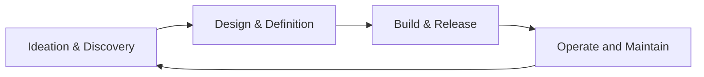
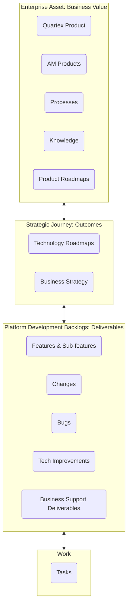

## Overview

Our agile Delivery Framework is designed as a robust and clear abstract mechanism by which value is derived, delivered, and maintained by the organisation.

This delivery framework describes at a high level our [value stream](../2.-Ways-of-Working/1.-Flow/#value-stream-mapping).

While the high-level framework itself is fixed, the [delivery practices](../4.-Delivery-Practices/) that live within it should be constantly evolving, such that the framework continues to support [our mission](/1.-Welcome/Mission).

You can see the detailed view of each of the process states by viewing the [Miro Board](https://miro.com/app/board/o9J_lKgSRGw=/?moveToWidget=3074457357376042791&cot=14)

## Topology of Business Value

## Team Structure

The Platform Development department is made up of multiple [Delivery Teams](#delivery-teams), a [Support Team](#support-team) and an [Enablement Team](#enablement-team).

The team structure can be found in the Team Directory of the [Knowledgebase](<https://playbook.platformdev.amdigital.co.uk/directories/team>)

### Delivery Teams

Product delivery teams are self organising, cross-functional teams that deliver against a product roadmap: each team has it's own product roadmap and is aligned to a business value area.

### Support Team

The support team is a cross functional team responsible for delivering business as well as 2nd and 3rd line platform support.

### Enablement Team

The Enablement Team is facilitates, supports and otherwise enables the Support and Delivery teams to carry out their work. If a team is wrestling with a particular challenge, there may be a member of the Enablement Team who can help them. It consists of the VP Engineering, Senior Product Manager, Tech Support Manager and UX Designer.
