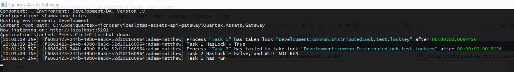
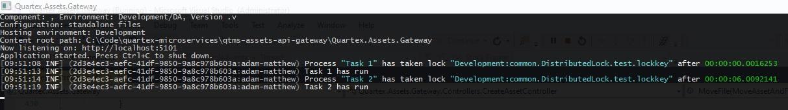

Quartex is a distributed system, with multiple microservices doing different things at the same time. This can be a recipe for race conditions to creep in and create strange bugs, especially at scale.

> _**NOTE**: the `IDistributedLock` examples below are intended to prevent two identical pieces of code running at the same time._

For example an early issue with large scale FTP uploads was that we would sometimes see multiple Asset records for the folder created in the database. The reason for this was multiple threads uploading files within the same folder would all try to create the parent record at the same time. Wrapping a distributed lock around the code creating the parent record solve the issue. As a concrete example of this, imagine two parallel processes importing two files: `/folder1/file1.jpg` and `/folder1/file2.jpg`, and assume `folder1` doesn't exist yet.
 	
* Both processes will try to create `folder1`
* the process importing file1.jpg gets there first, and grabs a lock (let's assume the key is called `ClientKey.CreateAsset.folder1`)
* the process importing file2.jpg gets there a second later, can't get the lock, which means that the folder is already being created (so it doesn't need to do anything at all)

_Note: it's quite possible that the second process may try to carry on before `folder1` is in the database. In which case it will probably throw an exception, but when it retries a few minutes later it will work fine._

The following debug logging shows `Task 1` grabbing a lock on a key and the running, then `Task 2` attempts to grab the same lock but fails (since `Task 1` has the lock on that key); as a result `Task 2` does not run at all.



Examples of this could be:

* Stop two instances of the same microservice from running a `RegularTask` at the same time
* Prevent two parallel HTTP requests to the same microservice from running the same initialistion

In each case, by using the distributed lock methods shown below, the first instance of the code will run, _and the second will not_ (because we know it is already being done).

## Using the Distributed Lock in C# code

You will need to dependency inject an `IDistributedLock` object into your service, as below:

```cs
private readonly IDistributedLock _distributedLock;

public MyService(IDistributedLock distributedLock)
{
    _distributedLock = distributedLock;
}
```

There are three patterns for using the distributed lock. In each case you need to generate a predictable key, and you will also need to specify how long the lock is valid for (which guards against the lock never being released if the calling code dies).

```cs

string lockKey = $"asset.Create.{_client.ClientKey}.{asset.Id}";

// only excecute the following code if you can acquire the lock
// the lock is not explicitly released, it will expire after the specified time
if (_distributedLock.AcquireLock(lockKey, TimeSpan.FromMinutes(5)))
{
    // code to execute
}


// attempt to acquire the lock
// you MUST explicitly check the HasLock property
using (var token = _distributedLock.UsingToken(lockKey, TimeSpan.FromMinutes(5)))
{
    if (token.HasLock)
    {
        // code to execute
    }
    else
    {
        // what to do when we do NOT have the lock? Probably nothing!
    }
}
// lock is explicitly released at the end of the using block

// similar to the above, but using a lambda
// If the lock cannot be acquired, it will simply not do anything
await _distributedLock.RunAsync(lockKey, async () => {
    // code to execute
}, 300);

```

## Running different code that access the same resource

> _**NOTE**: use this approach to allow two separate processes to run, but guaranteed to not run at the same time_

The examples below all focus on ensuring different instances (or threads) don't do the same work twice. E.g. don't try to create the same parent folder record twice.

However, there are other times you may need to use a distributed lock with different behaviour. Specifically you may need to run two different methods that access the same record. Both methods need to run, but it is crucial that they do not run at the same time. In this case, you can use the `AwaitLock` method, as illustrated below.

The crucial point with this example is that both pieces of code will run, but they _will not run at the same time_.


```cs
// thread / microservice 1
var lockExpiry = TimeSpan.FromMinutes(5);
var waitTimeout = TimeSpan.FromMinutes(2);

using (var token = _distributedLock.AwaitLock(lockToken, lockExpiry, waitTimeout))
{
    // run piece of code 1
}


// thread / microservice 2
using (var token = _distributedLock.AwaitLock(lockToken, lockExpiry, waitTimeout))
{
    // run piece of code 2
}

```

Note the `waitTimeout` parameter. If it takes longer than this amount of time to acquire the lock, an exception will be thrown.

The following screenshot with some debug logging active illustrates how this works.

