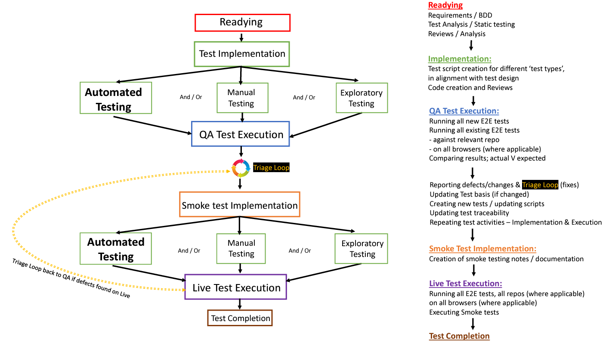

--- 
---

The above diagram outlines WHEN we need to execute our End to End (E2E) Regression tests on QA and LIVE. For a more detailed version and explanation of the test process, please see: [Test Process Workflow](Test-Engineering\Test-Process-Workflow.md) 

## Test implementation

Please note, it is not mandatory to implement or execute all 'test types', such as automation, manual and exploratory testing. Our focus is on automated testing (to grow our regression suite). We should only manually or exploratory test in the absence of automation, or in addition to it, and always to a purposeful objective. The type of testing implemented will be driven my many factors and is very heavily dependent on the individual back log item. 

## What is the difference between Manual and exploratory testing?
In a nuthsell, manual testing is generally very structured and rigid, it involves writing out test steps and then executing them. What it lacks is the ability for a tester to think outside the box and have freedom to use their skills, expereince and knowledge. Although manual testing can have its place and benefits, so can exploratory testing and it is a combination of these test types (including automation), which contribute to test coverage and overall quality and confidence in testing. 

For more information on Exploratory testing, please see: [Exploratory Testing](Test-Engineering\Exploratory-Testing.md) 

For more information on tge differences between Manual and Exploratory testing, please see: [Exploratory testing Vs Scripted Testing](https://www.softwaretestinghelp.com/exploratory-testing-vs-scripted-testing/) 

## QA Test execution

This should involve:
- Running ALL new E2E tests (on the relevant feature branch)
- Running ALL existing E2E tests 
- Running tests on ALL browsers (where applicable) 

The above should be run against the relevant repo, in GitHub actions:
[EDEN - DAM E2E Tests](https://github.com/amdigital-co-uk/eden/actions/workflows/dam-e2e-tests.yml)
[EDEN - Clients managaer E2E Tests](https://github.com/amdigital-co-uk/eden/actions/workflows/clients-e2e-tests.yml)
[qtui front end - Front End / CMS E2E Tests](https://github.com/amdigital-co-uk/qtui-front-end/actions/workflows/e2e-tests.yml)
[qtms-oai - OAI Open Archives Initiave (API) E2E Tests](https://github.com/amdigital-co-uk/qtms-oai/actions)

## What is the triage Loop?

As a result of QA Test Execution, defects maybe discovered which need to be fixed, deployed and re-tested. This may involve updating requirements, updating existing test scripts or writing new one's entirely. This triage loop continues until (ideally) there is no presence of defects and there is team confidence in the quality of the implementation. Once

## Smoke Test implementation

The reason Smoke test notes are added after QA execution and not in initial 'Test implentation', is as result of the possible Triage loop (explained above). If a defect is found which requires a change to development implentation, then a corresponding test will need to be updated or written (if no exisiting coverage). Ideally, we would be covering this with automation. However, it's also not a bad idea to have a smoke test note to manually verify it upon release. This is a 'sanity' test and gives further confidence in the quality. 

## Live Test execution

This should involve:

- Running ALL E2E tests, on all repos (where applicable)
- Running E2E tests on ALL browsers (where applicable)
- Executing Smoke tests (usually on chrome)

