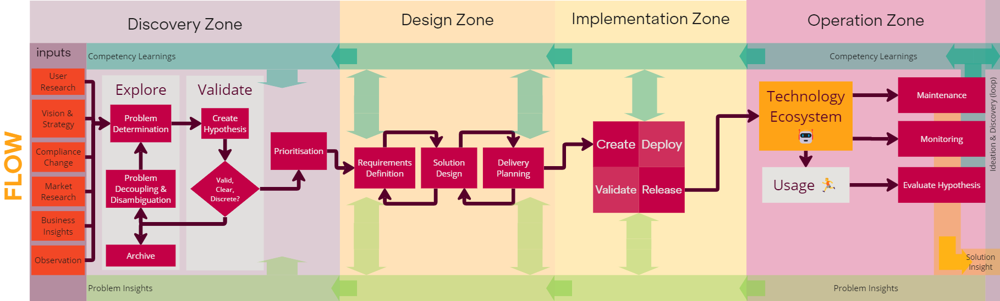

**AMPFlow** (AM Platform Flow) is a evolving, adaptive, open-closed technology delivery system designed by and for AM’s Platform Development Division to enable us to solve business problems of any type in order to generate business value, using technology (“technology problems”).

??? Note "Structure & Terminology"
    **AMPFlow** is built up of a number of structural components:

    - A [Goal](#goal) & [Tenets](#tenets)
    - [Zones](#zones)
    - [**FLOW**](#flow)
    - [Governance](../Governance/index.md)
    - [Toolkit](../Toolkit/index.md)

    **AMPFlow** describes AM’s Software Development Lifecycle (SDLC), but does not assume solving that technology problems will require the creation of software. Instead of referring to the SDLC, we refer to the “Delivery System” or “AMPFlow” interchangeably, and the “Problem Solving Lifecycle”.

    These components, and other terms used in by **AMPFlow** are defined on the [Terminology page](AMPFlow-Terminology.md) 

## Goal

    

        Enable a fast, predictable, safe, and transparent flow of business value, by incrementally creating stable and secure solutions to technology problems of any type.
    

## Tenets

-   :material-brain:{ .lg .middle } __Principles__
   
    ---

    - Continuous Improvement
    - Continuous Deployment
    - Continuous Quality
    - Continuous Collaboration
    - Continuous Planning
    - Continuous Autonomy
    
    [Read :octicons-arrow-right-24:](../Tenets/index.md)

-   :material-scale-balance:{ .lg .middle } __Ideals__
   
    ---

    - Locality & Simplicity
    - Focus, Flow & Joy
    - Psychological safety
    - Improvement of daily work
    - Value focus
    - A Bias towards action
    
    [Read :octicons-arrow-right-24:](../Tenets/index.md)

## Zones

{ align=right, style="width:300px; float:right;" }

**AMPFlow** has 4 zones:

### Discovery Zone

**Goal:** Ensure that the next problem solved will produce business value effectively

The first zone is where problems are identified, and understood before they are validated, prioritised.

*Identifying* and *understanding* problems means ensuring there is alignment on the problem being solved, that they are discrete and independent problems.

A validated problem means it is:

1.	genuine – it really exist
2.	valuable – solving it is likely to Implementation business value
3.	viable – solving it is worthwhile
4.	feasible – solving it is possible.

*Validation* may be time or situation specific (problems may become valid or invalid over time or under varied conditions).

*Prioritised* means identifying which problem is most valuable to solve next.

### Design Zone

**Goal:** Determine the best solution (for the problem) and approach to implementing it

The second zone is where solutions are researched, selected, then designed and implementation is planned.

Design is iterative. High-level solutions to the problem are determined through exploration (divergence) and alignment (convergence). When alignment it reached, low-level design, can commence, where implementation specifications are detailed. 

At each level (high- and low-level), design will generally include a functional, technical, and experiential component.

Additionally, at each level, high- and low-level delivery plans can be produced: how would this solution be implemented?

During design insights are created as more is learnt about the problem. This creates a feedback loop into the first zone, enabling improved problem discovery. This may result in the problem being broken down into smaller problems which can be solved independently.

### Implementation Zone

**Goal:** Incrementally implement and deliver solutions 

The designs and plans created during the design zone are implemented and executed. 

Implementation can commence as soon as enough is known about the solution and a plan is in place. The simplest, highest priority deliverable can be implemented while design can then continue for 

### Operation Zone

**Goal:** Measure success of solutions, assert continuity, and derive insights for next actions.

## Flow

**FLOW** is the core and primary component of the delivery system. Illustrating the high level direction of information and action within the delivery system, aiding in planning and navigation.

Flow is agnostic of how, who, or what, but includes generic activities and the order they will typically occur.

!!! warning "Continuous Feedback"

    While **FLOW** goes left to right, there is **continuous feedback** meaning that activities on the left may continue to occur repeatedly throughout the problem lifecycle.

### Flow Activities Elements

These activities are generic and do not specify how they are performed. *How* is either controlled by [governance](../Governance/index.md), or determined [as appropriate by teams](../Toolkit/index.md).

??? info "Explore"

    **Objective**: Identify new opportunities and potential areas for improvement or innovation with technology for the business.

    Exploring is the act of finding and understanding problems. Problems may arise from many sources, such as observations (see Measure and Monitor), compliance changes, or business strategies.

    Problems can be broken down to make them easier to solve, usually as the understanding of the problem improves. This may produce linked problems (a problem is discovered to be more than one related problems), discrete problems (a problem is discovered to be more than one unrelated problems), or descendant problems (a larger problem can be addressed piecemeal and incrementally).

    Problem determination involves understanding the type of problem. Different types of problems require different actions, in order to efficiently and effectively move away from chaos towards complex problems and clear problems.

??? info "Validating"

    **Objective**: Determine if the problem can and should be solved by the business, and produce a hypothesis for how it the value it will create.

    Validation tells us if a problem is real, clear and discrete, and if not leads us to breaking problems down and performing clarification. Validation identifies value hypotheses, viability, and feasibility.

    Validation ideally happens as early as possible, to reduce waste. However, throughout the problem lifecycle more is learnt about the problem, and new linked or descendant problems may be identified (see problem insights), and thus validation happens continuously. 

    Problems determined to be invalid are archived.

??? info "Prioritising"

    **Objective:** Determine what the order in which problem should be solved.

    Valid problems are prioritised so that work can commence in other zones on the most valuable problem.
    Priorities can change, and as validation is continuous, so is prioritisation. Changing priorities can produce waste, however, failure to shift focus to higher priority problems will be more wasteful. 

??? info "Requirements Elicitation"

    **Objective**: Gather detailed and specific requirements from stakeholders.

    **Example Approaches**: interviews, surveys, and requirements workshops.

??? info "Solution Design"

    **Objective**: Develop technical, user, and functional designs for an incrementally delivered solution.

    **Example Approaches**: Create design mock-ups, architectural diagrams, and detailed specifications.

??? info "Delivery Planning"

    **Objective**: Plan the steps, timeline, and resources needed for implementation.

    **Example Approaches**: Develop delivery timelines, allocate resources, and set milestones.

??? info "Implement/Deploy/Validate/Release"

    **Objective**: Execute the incremental development, testing, deployment, and release of the solution.

    **Example Approaches**: Code development, testing, deployment to production, and post-release validation.

??? info "Element: The Technology Ecosystem"

    This represents the culmination of all technology created, such as tools, platforms, services, configurations.

??? info "Hypothesis Evaluation"

    **Objective**: Assess the effectiveness of the implemented solution against initial hypotheses.

    **Example Approaches**: Analyze success or performance metrics, user feedback, and business impacts.

??? info "Problem Insights"

    **Objective**: Extract insights and lessons throughout the problem lifecycle to refine the problem, solution, and plan.

    **Example Approaches**: Collect and manage risks, assumptions, issues and dependencies. Review progress and estimates, and re-plan frequently. Perform stakeholder and customer interviews, tests, and demos.

??? info "Competency Learnings"

    **Objective**: Extract insights and lessons from the problem lifecycle to improve future processes.

    **Example Approaches**: Conduct retrospectives and after action reviews, review estimation accuracy and time spent, create experiments, document and communicate outcomes, and update toolkit guides and default approaches.