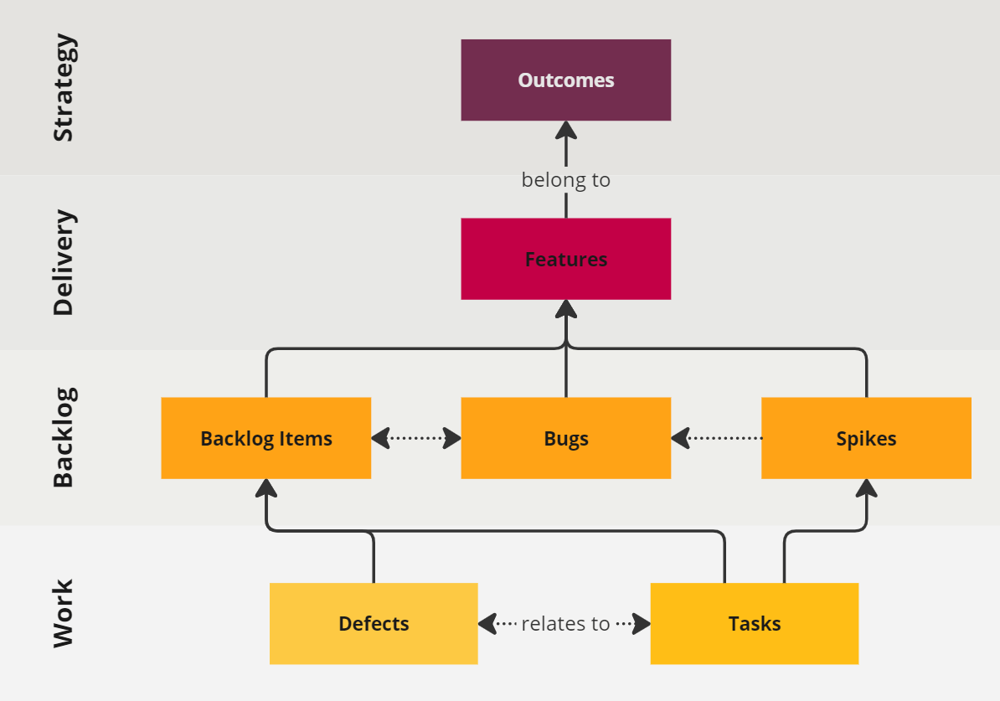
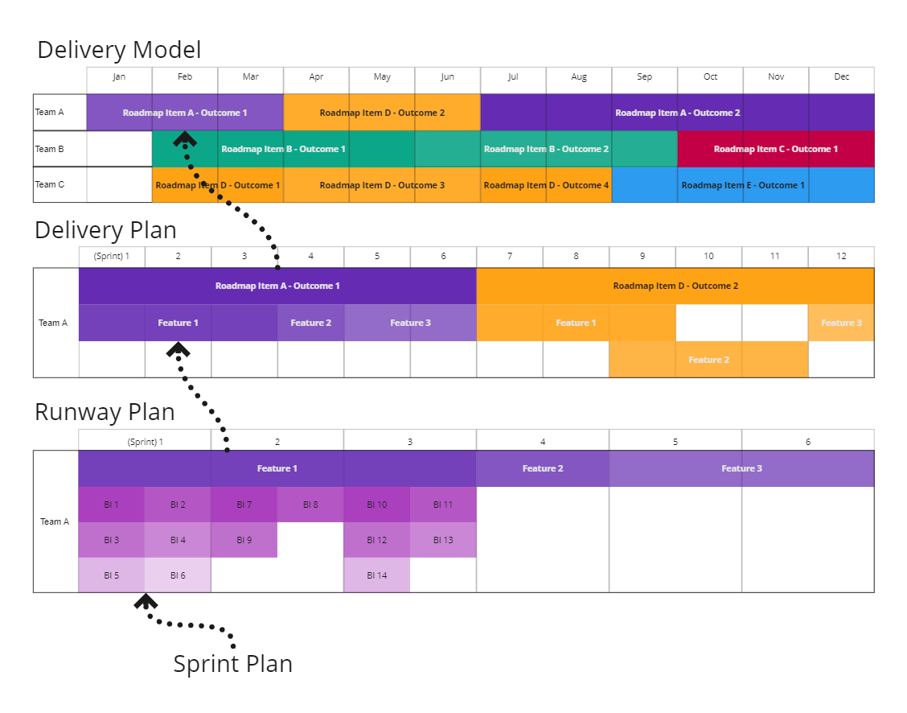

Workflow Management describes the way that our solutions are broken down into a hierarchical structure. 

Throughout the problem lifecycle we break large solutions to problems down into small value increments, which are in turn broken down into the smallest independently deployable chunks, each of which require various specific tasks to be performed. 

The objective of workflow management is to provide an adaptable but repeatable structure that reflects this relationship between problems, solutions, value increments, and deployments.

## Workflow Hierarchy

The workflow hierarchy as 4 layers: 

1. Strategic:
   1. [Outcomes](#outcome), which belong to a Roadmap Item (in Product Board)
2. [Features](#feature), which belong to Outcomes
3. Backlog, including:    
    1. [Backlog Items](#backlog-item), and may relate to Bugs
    2. [Spikes](#spike), which belong to Features, and may relate to Bugs 
    3. [Bugs](#bug), which belong to Features, and must relate to Backlog Items
 4. Work, including:
    2. [Tasks](#task), which belong to Backlog Items or Spikes, and may relate to Defects 
    1. [Defects](#defect), which belong to Backlog Items, and must relate to Tasks
 

## Planning Mechanisms

Each layer has its own planning mechanism:

1.	[Delivery Modelling](Delivery-Modelling.md) is used to model the delivery of Outcomes, and therefore show how the roadmap will be progressed. Looking ahead around 12 months.
2.	[Delivery Planning](Delivery-Planning.md) is used to plan the delivery of Features, and therefore show how Outcomes will be delivered. Looking ahead around 6-12 sprints / 3-6 months.
3.	Runway Planning is used to plan the implementation of Backlog Items, and therefore show how Features will be delivered.
4.	Sprint Planning / Iteration Planning is used to plan the tasks that must be performed in order to implement a backlog item.
Using this structure will mean that there is an inherent link between each plan.As estimates and plans are produced for lower layers, their parent item’s estimates and plans must also be updated.
 

!!! warning "Illustrative only" 
    Actual plans will contain **significantly more contextual information** than is shown in this image, such as dependencies, estimates, ownership, status, risks…

## Workflow Item Definitions

### Outcome

An Outcome is a generic term for a sub goal of a product roadmap objective. The term Outcome could be replaced by “Milestone” or “Epic”. We use the term outcome because it carries more meaning than epic, and is more flexible than milestone. Some Roadmap items may only have one Outcome, while others may have many.

Outcomes must belong to a roadmap item.

### Feature

A feature is a generic term for a sub-goal of an Outcome. Features must be independently usable and valuable. 
Features may require changes to many platforms/repositories.

A feature is not necessarily a functional or user-centric value improvement. While some features may be well described as “user stories”, a feature can also describe non-functional improvements. 

Features can be categorised by the type of investment or purpose, i.e. is this maintenance or added value? If this is maintenance then which type: perfective, preventative, adaptive, or corrective (bugs are generally corrective maintenance).

Features must belong to an Outcome.

### Backlog Item

A backlog item is the smallest operational increment that can be made.

A backlog item should only affect a single repository, for example.

An operational increment must be independently deployable and testable, it must not cause damage, but individually may not be usable or valuable. Each feature would typically require several backlog items.

Backlog items must belong to a feature, and may be related to a bug.

### Spike

A spike is a technical investigation used to remove uncertainties around technical viability and feasibility. Spikes seek to answer specific questions. Then outputs of a spike will include a documented summary of the learnings, and may also include a proof of concept.

### Bug

A bug is an issue identified within production applications. A bug occurs when a feature does not behave as expected. 

Bugs must belong to a feature - in principal a feature's requirements or specifications are not being met. 

A bug must relate to at least one backlog ite. It may affect multiple repositories, and may therefore require multiple backlog items.

### Task

A task describes any discrete piece of work. Each backlog item will require several tasks in order to produce an operational increment. These tasks may span multiple disciplines such as development, testing, design, documentation, and so on.

Task items must belong to a backlog item, and may relate to a Defect.

### Defect

A defect is an issue identified during the development lifecycle. 

Defects must belong to a Backlog Item, and will relate to at least one task.

## Toolkit

!!! toolkit "Toolkit"

    <!-- material/tags { include: [Workflow Management] } -->
