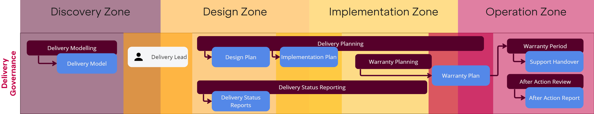

Delivery Governance ensures the effective management and team autonomy of project delivery processes to achieve successful and timely project outcomes while adhering to the minimum viable guardrails, standards and protocols.

## Responsibilities

!!! info "Delivery Lead" 
    The person who will be **accountable** for asserting delivery governance for the problem. Normally this would be an Agile Delivery Manager.

!!! info "Engineering Lead" 
    The person who will be:

    1. **accountable** and **responsible** for technical validation.  
    2. **accountable** for the implementation and technical design.
    3. **responsible** for coordinating engineering resources.
   
!!! info "Product Lead" 
    The person who will be **accountable** and **responsible** for effective problem validation, requirements elicitation and producing functional specifications.

!!! info "Design Lead" 
    The person who will be **accountable** and **responsible** for effective experiential design

!!! info "Delivery Team" 
    The team who will be **responsible** for solving the problem, and performing the governed activities. Normally this will be an Engineering Team, along with the Product and Design Leads.

