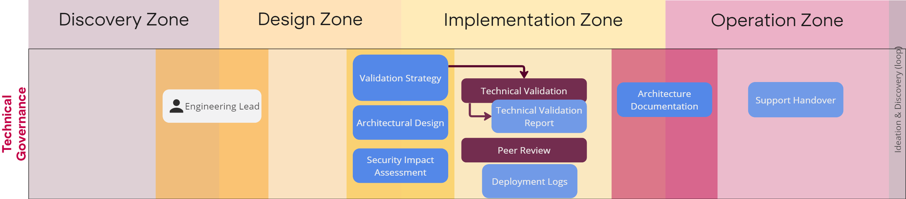

Technology governance controls how we implement technology to ensure that we comply with laws and compliance standards.

## Overview

### Responsibility Assignment

An Engineering Lead must be assigned before design can commence.

See [delivery governance responsibilities](/Ways-of-Working/Governance/Delivery-Governance/#Responsibilities).

### Validation

#### Validation Strategy

An approach to how we will validate our technical implementation is required before implementation can commence. A validation strategy is a wider concern shared with problem governance.

#### Technical Validation & Technical Validation Report

Technical validation is performed continuously during implementation. Different approaches may be taken to perform technical validation as appropriate for the specific problem, and the planned overall approach will be defined in the Validation Strategy.

While technical validation is being performed, evidence of this must be documented, this forms a Technical Validation Report. 

### Architectural Design

A high-level architectural design is required before implementation can commence.

!!! Note "Continuous Design"
    Low-level architectural design can be developed during implementation, and is __not fundamentally required BEFORE COMMENCING implementation__. It is perfectly valid, and in many instances highly beneficial, to be designing while implementing, and therefore producing and evolving low level architecture while implementing solutions.  

### Security Impact Assessment

A security impact assessment must be performed for every planned change to our technology estate.