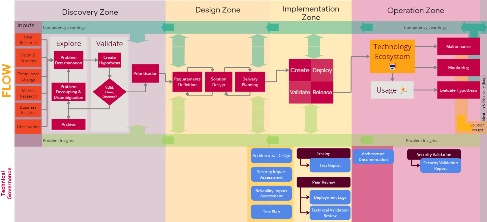

Technology governance controls how we implement technology to ensure that we comply with relevant laws and standards, and ensure that we create stable, secure, and robust solutions to technology problems.

