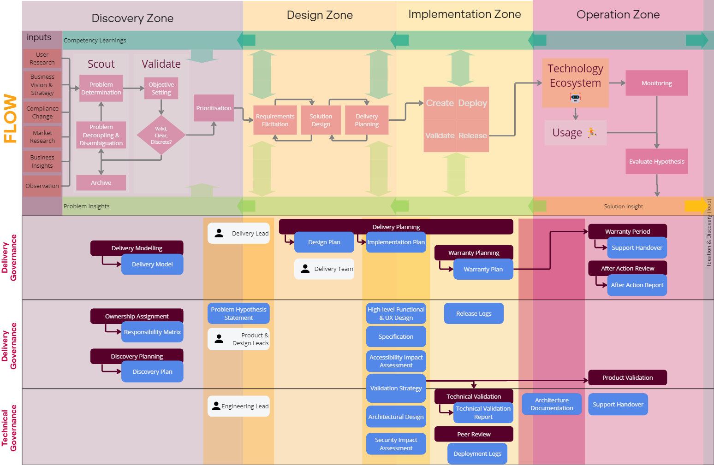

Governance sets out controls that stipulate how we work. 

Controls can reduce autonomy and adaptability, and therefore should be minimised. The purpose of governance must me made clear in order to prevent unwanted controls from being introduced

There are 3 key areas of governance: [Delivery](Delivery-Governance), [Product](Product-Governance), and [Technology](Technology-Governance), each with specific purposes.

## Objectives

Governance within **AMPFlow** aims to:

> 1. Prevent the implementation of critical flaws
> 2. Guarantee excellent information flow
> 3. Maintain and improve team autonomy

Achieving 1 and 2 gives rise to 3.

## Overview

