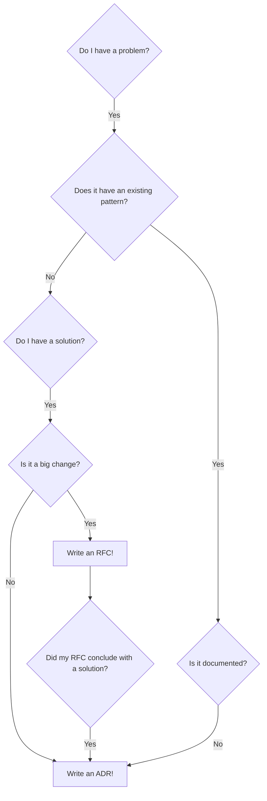

## Document Decisions

Have you made a significant decision that impacts how engineers write software? Write an ADR! Is the decision a big solution that has a large consequences on our Technical Estate? Write a RFC first!

### What is an Architecture Decision Record (ADR)?

An ADR is a document that captures a decision, including the context of how the decision was made and the consequences of adopting the decision. Read more about ADRs and its benefits [here](Architectural-Decision-Records)

### What is a Request for Comments (RFC)?

An RFC is a process used for gathering feedback on a proposed decision or change before it gets implemented. This process is usually more formal and is aimed at creating a space for team members to discuss various approaches, trade-offs, and potential consequences. Unlike ADRs, which document decisions that have already been made, RFCs are used to guide the decision-making process itself. In many cases the conclusions reached in the RFC discussions often form the basis for the content of a subsequent ADR. Read more about RFC and its process [here](Request-for-Comments)

## When should I write one?

An ADR should be written whenever a decision of significant impact is made; it is up to each team to align on what defines a significant impact. To get you started, below are a few scenarios to help support that decision making process.

### Using Existing Pattern

- Do I have a problem? Yes
- Does it have an existing pattern? Yes
- Is it documented? No
- Write an ADR!

### Proposing large changes

- Do I have a problem? Yes
- Does it have an existing pattern? No
- Do I have a solution? Yes
- Is it a big change? Yes
- Write an RFC!
- Did my RFC conclude with a solution? Yes
- Write an ADR!

### Proposing small/no changes

- Do I have a problem? Yes
- Does it have an existing pattern? No
- Do I have a solution? Yes
- Is it a big change? No
- Write an ADR!

## TL;DR

!!! Question "When should I write an Architecture Decision Record?"

    Almost always!
