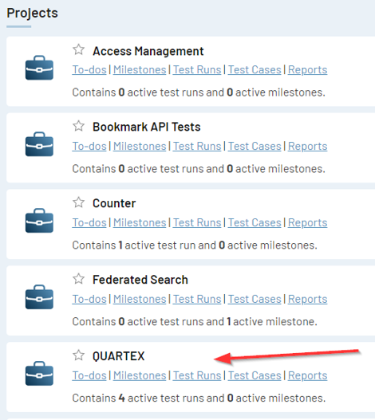
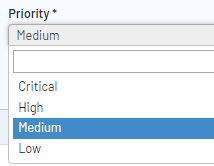
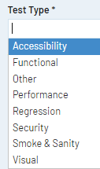
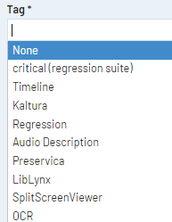
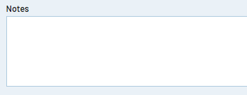

### Introduction
This document outlines best practices to follow when adding in test cases to Test Rail

### <u>Test Rail</u>
TestRail is a web-based test case management tool. It is used by QA engineers, developers, and team leads to manage, track, and organize software testing efforts. TestRail allows team members to design test cases, organize test suites, execute test runs, and track their results, all from a modern and easy-to-use web interface. 

### <u>Adding in test cases</u>

- 1- Log in to [Test Rail](https://ampd.testrail.io) using valid credentials (stored in Keeper)
- 2 - Navigate to the [Test Rail Dashboard](https://ampd.testrail.io/index.php?/dashboard)
- 3 - Select the project you want to add test cases to, i,e. "Quartex"

      

4 - Click on the ‘Test cases header’

  

5 - Click on the ‘Add Test case’ button

  

6 - Select the test template you wish to use

### <u>Test Templates</u>

There are 3 test templates to choose from:

- 1 - ‘Test Case (steps)’

- 2 - ‘Behaviour Driven Development’ 

- 3 -  ‘Exploratory session (test charter)’ 
    
 

#### <u>‘Test Case (steps)’ Template</u>

‘Test Case (steps)’ –  This is the default, used for traditional manual testing, detailing individual steps to carry out, along with the expected result

 

#### <u>‘Behaviour Driven Development’ Template</u>

‘Behaviour Driven Development’ – Most frequently used and recommended due to following a BDD framework , for manual testing and outlining automation steps

 

#### <u>‘Exploratory Session (Test Charter)’ Template</u>

‘Exploratory session (test charter)’ – Only used for exploratory testing purposes. More about exploratory testing can be found [here](/Ways-of-Working/Guides/Exploratory-Testing.md) 

 

## <u>Test Case Fields Defined</u>

#### <u>‘Section’ Field</u>

Select the Quartex site area which the test affects

 

#### <u>‘Template’ Field</u>

Select the appropriate test template according to the test's needs

 

#### <u>‘Type’ Field</u>

Select the type of test from the available options and which is appropriate for the test case. For example, Manual or Automated

The available options are:

- Automated - Cucumber/Playwright (ie: Tests that live in the 'Quartex.Regression.Tests' folder in the qtui-front-end repository, where cucumber <b>is</b> implemented)

- Automated - Playwright (ie: Tests that live in the 'Quartex.FrontEnd.E2ETests' folder in the qtui-front-end repository, where cucumber is <b>not</b>  implemented)

- Integration 

- Manual

- Partially automated

 

#### <u>‘References’ Field</u>

This should be the backlog item reference number from DevOp’s, once saved it will be hyperlinked to the backlog item

 

#### <u>‘Priority’ Field</u>

This can be left as the default, which is ‘medium’ (we do not use this functionality & unfortunately it can't be removed)

 

#### <u>‘Test Type’ Field</u>

Select the ‘type’ of test which best describes the test case. 

 

#### <u>‘Tag’ Field</u>

Select any applicable tags from the available options. 

 

#### <u>‘Reasoning for why cannot be automated or is only partially (if applicable)’ Field</u>

Select the reason why the test case is not automated from the available options.

 

#### <u>‘Notes’ Field</u>

This should be used to record any useful information to aid the testing, such as mention of test data, environments or to refer to any automation notes. 

  

## References
- [Test Rail](https://ampd.testrail.io/)
