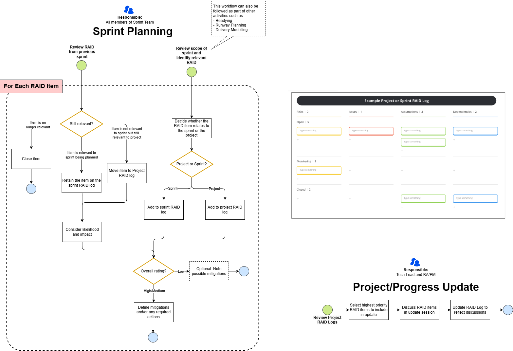

## Introduction

- RAID capture, management and mitigation is a continuous process throughout the entire problem lifecycle. 
- If you are unsure of how to approach RAID capture, management and mitigation, the following guide documents a default approach.
- This may be a useful starting point for delivery teams, and as competency grows, teams are encouraged to experiment with, define and evolve their own processes and procedures whilst operating within the stipulated minimum viable guardrails.
- The guidance demonstrates several options for managing RAID so that teams can find what works best for them. If a team is unsure where to start they are encouraged to arrange a short session with a RAID SME who, through discussion, can make recommendations on the best approach for the team.

## RAID Subject Matter Experts

- **Alex Rae** / Agile Delivery Manager: alex.rae@amdigital.co.uk 
- **Carol Webb** / Senior Business Analyst: carolw@amdigital.co.uk   
- **Matt Braisher** / Product Manager: mattb@amdigital.co.uk  

## Raid Reporting Mechanisms 

Reporting RAID (Risks, Assumptions, Issues, and Dependencies) is crucial for effective project management and ensuring transparency across the team and stakeholders.

## How to Report RAID

- Maintain a comprehensive RAID log, typically in a shared document or tool like AzDo, Jira or Miro or any project management tool 
- Ensure the RAID log is updated regularly, before key meetings or ceremonies
- Use a standardized format for reporting to ensure clarity and consistency
- Tailor the RAID log for the audience: this may entail extracting key RAID items and adding them to a PowerPoint deck.  Key items can be discussed individually or rolled up to form key RAID themes to discuss with stakeholders (see example below).
- Be mindful of the level at which you're communicating at, and tailor the level of detail to suit the audience

## When to Report RAID

Define requirements for reporting RAID with your delivery team and stakeholders and continuously monitor and review this as things change 

- **Project initiation:** during the initial planning phase, identify and document all potential RAID elements to establish a baseline
- **Sprint planning:** before each sprint, review and update the RAID log to ensure any new items are captured and addressed
- **Daily standups:** briefly mention any critical RAID updates that might impact daily work to keep the team informed 
- **Sprint reviews / Retrospectives:** at the end of each sprint, review the RAID log to discuss what was resolved, what new items were added, and what ongoing items need further attention 
- **Ad hoc reporting:** anytime a significant RAID item emerges, update the RAID log and communicate it to the team promptly to mitigate impacts   

## What to Report

??? info "Risks"

    - **Description:** Clearly describe the potential problem
    - **Impact Rating:** Rate the risk based on how severe the impact would be if the risk materializes
    - **Impact Description:** Explain the potential impact on the project if the risk materializes
    - **Likelihood Rating:** Assess the likelihood of the risk occurring. [Determine Likelihood Guidance](https://adammatthewdigital.sharepoint.com/:fl:/g/contentstorage/CSP_d1c54a5b-af14-4f8c-8476-48e3aab13057/Edu-m0SIjT1ImaR9g33SlbMBLDlnaEwLHlu0q0rj_IOiiQ?e=idqG91&nav=cz0lMkZjb250ZW50c3RvcmFnZSUyRkNTUF9kMWM1NGE1Yi1hZjE0LTRmOGMtODQ3Ni00OGUzYWFiMTMwNTcmZD1iJTIxVzByRjBSU3ZqRS1FZGtqanFyRXdWMkNZWV96N0JRbEdvQmQ1T3F2N2ZocUxmREZfeG5pUlRvaGJpQWJrMUthSiZmPTAxTlY0NUlUTzNYMk5VSkNFTkhWRUpUSkQ1UU42NUZGTlQmYz0lMkYmYT1Mb29wQXBwJnA9JTQwZmx1aWR4JTJGbG9vcC1wYWdlLWNvbnRhaW5lciZ4PSU3QiUyMnclMjIlM0ElMjJUMFJUVUh4aFpHRnRiV0YwZEdobGQyUnBaMmwwWVd3dWMyaGhjbVZ3YjJsdWRDNWpiMjE4WWlGWE1ISkdNRkpUZG1wRkxVVmthMnBxY1hKRmQxWXlRMWxaWDNvM1FsRnNSMjlDWkRWUGNYWTNabWh4VEdaRVJsOTRibWxTVkc5b1ltbEJZbXN4UzJGS2ZEQXhUbFkwTlVsVVVFeFpXVVpITTAxVFRFRlNTREpTUVVoQ1YxQlVWRlUxU1ZFJTNEJTIyJTJDJTIyaSUyMiUzQSUyMmMyM2JhNjM2LTA3OTAtNGRiMS05ZTBhLTRhNDhlZjI1NmFkMyUyMiU3RA%3D%3D)
    - **Mitigation Plan:** Outline steps to mitigate the risk
    - **Owner:** Assign responsibility for managing the risk

??? info "Assumptions"

    - **Description:** Document assumptions made during project planning
    - **Rationale:** Explain why these assumptions are considered valid
    - **Impact:** Describe the impact if the assumptions prove incorrect
    - **Impact Rating:** Rate the risk based on how severe the impact would be if the assumption is incorrect
    - **Confidence Level Rating:** Indicate the degree of certainty associated with the accuracy or likelihood of a RAID item, helping prioritise actions and focus resources effectively
    - **Validation:** Outline steps to validate the assumptions during the project

??? info "Issues"

    - **Description:** Identify tasks or components that depend on each other
    - **Impact:** Explain how issues affect the project timeline and milestones
    - **Impact Rating:** Rate the risk based on how severe the impact would be if the issue cannot be resolved or removed
    - **Management Plan:** Describe how dependencies will be managed
    - **Owner:** Assign responsibility for managing the dependencies

??? info "Dependencies"

    - **Description:** Identify tasks or components that depend on each other
    - **Impact:** Explain how dependencies affect the project timeline and milestones
    - **Impact Rating:** Rate the risk based on how severe the impact would be if the dependency cannot be resolved or removed
    - **Management Plan:** Describe how dependencies will be managed
    - **Owner:** Assign responsibility for managing the dependencies

## RAID Workflows

RAID workflow applied to the full-problem solving lifecycle (AMPFlow)
- A RAID workflow as it applies to the AMPFlow delivery system

## Key Pointers

**Ownership**

- typically, ownership of the RAID log will change throughout the full problem-solving lifecycle 
- ensure that ownership: roles and responsibilities are clearly defined at all times, if they aren't, take action to resolve ASAP

**Handovers Between Zones**

- handovers generally occur between zones
- schedule a RAID handover event, ensure all knowledge is transferred: key findings / next steps are clearly understood

**Managing RAID's impact on viability / feasibility of the problem / solution**

- RAID has the potential to influence whether a piece of work, be it a product, feature, BLI etc is still valid
- Therefore, we must be continuously discovering and monitoring new RAID entries, assessing their potential impact, likelihood and communicating this with our colleagues and stakeholders
- Draw on Product Manager, Engineer, UX, Delivery Manager perspectives to ensure we are covering all areas
- It's challenging to manage this effectively amongst other responsibilities
- Therefore use 'mechanisms' to define a workflow for RAID and assign responsibilities - this workflow can and will adapt to change and evolve over time. continuously review its effectiveness and look for new ways to improve it

**Operation Zone**

- once work is passed from the 'implementation zone' into the 'operation zone' the RAID log will be handed over to the support team
- TBD - currently working with support to define an initial workflow for this 

## RAID applied to sprint planning at delivery team level
A RAID workflow as it applies to delivery team sprint planning

## Key Pointers

**Assigning RAID Entries to a Project or Sprint**

- ensure that it is clear whether a RAID item relates to a sprint or a project so that it is managed and reported appropriately
- use separate RAID logs or a single RAID log with items labelled appropriately - there is no right or wrong way to do this
- a sprint RAID item will typically be managed by the sprint team and will be short lived
- project RAID items may require communication with a wider audience, e.g. as part of stakeholder updates

**Assigning Ratings:**

- ratings can take several different formats, for example High/Medium/Low, 1-5
- choose a consistent way of rating all items so that they can be easily compared against each other
- for all types of RAID, rating the impact helps determine whether mitigations are required
- for Risks a rating for the likelihood of it materialising provides further insight into the need for mitigation planning
- likelihood and Impact ratings can be combined to determine which risks pose the biggest threat
- for Assumptions a confidence rating on the accuracy of the assumption, combined with the impact rating, provides insight into the priority that should be given to validating the assumption

**Planning Mitigations:**

- mitigations or management plans should be recorded for RAID items that have the potential to cause a significant impact on a sprint or project
- these plans should be reviewed and updated in light of new information or a change to the ratings assigned to the RAID item

**Defining Continuous Review Mechanisms:**

- it can be difficult to find time for RAID amongst other responsibilities
- identifying regular checkpoints for reviewing the RAID log can prevent it being lost amongst all the work that is happening 
- what 'regular' means depends on whether the item is a project or sprint level item.  For example, sprint items may be reviewed daily whereas project items may be reviewed once per sprint

## RAID Tooling Options

- Review the tooling section of the Knowledgebase for current [default document templates](https://knowledgebase.platformdev.amdigital.co.uk/Tools-and-Providers/AMPFlow-Governance/).
