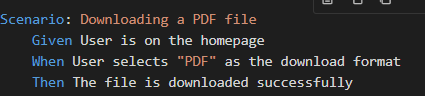
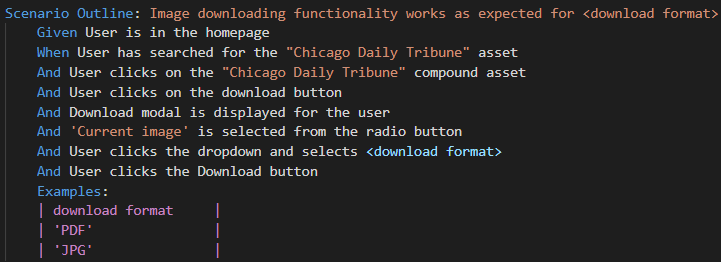
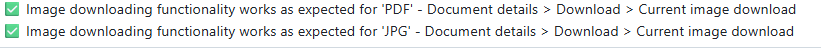

## Introduction

This document outlines best practices to follow when writing Gherkin scenarios for Playwright test scripts. It is important to note that this is only applicable to the Eden and Qtui Front End regression suites, as these are the only suites that use Gherkin.

## Scenario:

- Represents a single test case with fixed steps and data.
- Does not support Examples tables for parameterization.
- Each Scenario is executed as a standalone test.

Example: Scenario:
 
   

This is a single test case for downloading a PDF file.

## Scenario Outline:
- Used for parameterized testing.
- Allows you to define a template for a test case with placeholders
- Requires an Examples table to provide multiple sets of data for the placeholders.
- Each row in the Examples table generates a separate test case.

Example: Scenario Outline:

  
 
Notice how , <download format> is passed in the scenario outline title and it MUST be.
 
- This generates two test cases:
    
    - One for format = PDF.
    - Another for format = JPG.

And it is here through the reporting (much clearer)

  
 
In summary:

- use Scenario for single test cases
- use Scenario Outline when you need to test the same steps with multiple data sets.
